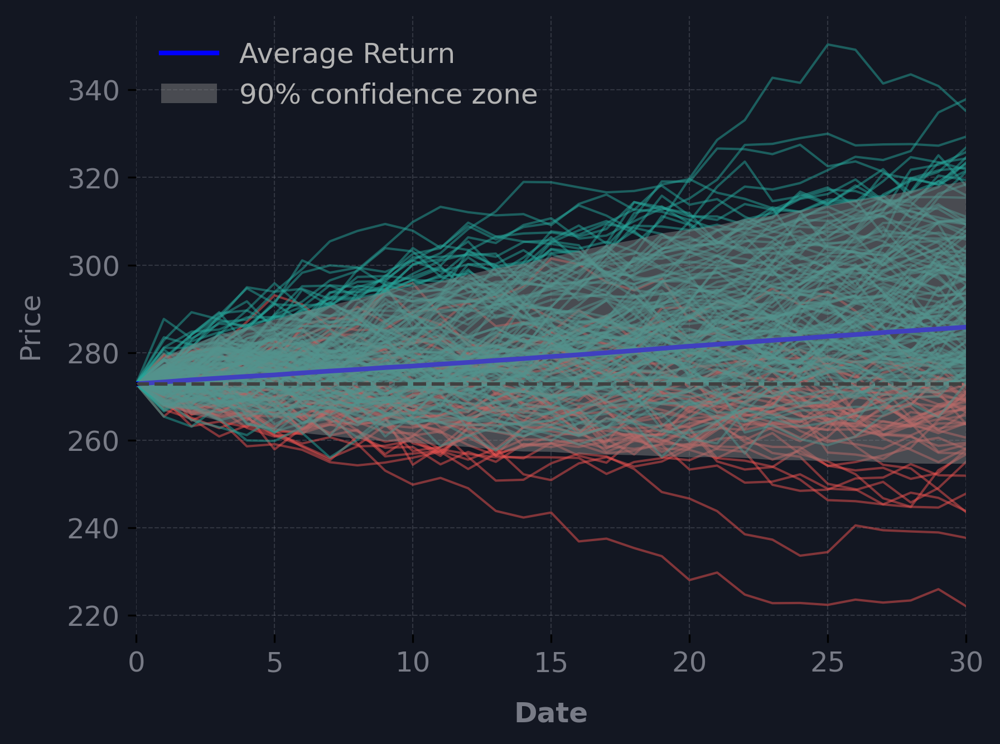

# 📈 Monte Carlo Financial Risk Engine

A Python command-line tool that fetches historical market data and runs Monte Carlo simulations to estimate future price distributions and standard risk metrics. Built to practice system design, API integration, and quantitative programming in Python.

---

## ⚡ Quickstart

Clone the repository and install the dependencies:

    git clone https://github.com/your-username/your-repo-name.git
    cd your-repo-name
    pip install -r requirements.txt

Set up your environment variables by creating a `.env` file in the root directory and adding your Finage API key:

    FINAGE_API_KEY=your_api_key_here

### Run a Simulation
Run the engine directly from the terminal. For example, to simulate 10,000 future paths for Apple stock over the next 252 trading days based on historical data:

    python main.py --symbol AAPL --asset stock --start_date 2023-01-01 --end_date 2024-01-01 --iterations 10000 --days 252

---

## 🏗️ System Architecture

The project is broken down into modular components to separate data fetching, computation, and visualisation:

* **Scraper (`scraper.py`):** Handles network requests to the Finage API. Includes basic error handling and custom exceptions for missing data or API failures.
* **Simulator (`simulator.py`):** A vectorized engine using NumPy to generate price paths efficiently without relying on standard Python loops.
* **Analytics (`analytics.py`):** Computes the statistical distributions and standardizes the timeframe calculations (handling the difference between 24/7 crypto markets and standard equity trading hours).
* **Visualizer (`visualizer.py`):** Uses Matplotlib to generate and save a chart of the simulated confidence intervals and mean paths.

---

## 🧮 The Mathematics

The engine calculates standard financial risk indicators to evaluate the simulated price paths:

* **Geometric Brownian Motion (GBM):** The core model used to simulate asset paths, assuming constant drift and volatility based on historical log returns.
* **Value at Risk (VaR) & Conditional VaR (CVaR):** Quantifies potential downside risk by looking at the 5th percentile of the simulated outcomes and the expected shortfall beyond that point.
* **Sharpe & Sortino Ratios:** Evaluates risk-adjusted returns. The Sortino ratio is specifically calculated to penalize only downside variance rather than overall volatility.
* **Ulcer Index & Average Maximum Drawdown:** Measures the depth, duration, and worst-case severity of simulated drawdowns to provide a comprehensive view of tail risk.
* **Expected CAGR:** Calculates the projected Compound Annual Growth Rate of the mean simulated path (dynamically guarded to only evaluate on multi-year timeframes to prevent mathematical distortion).
